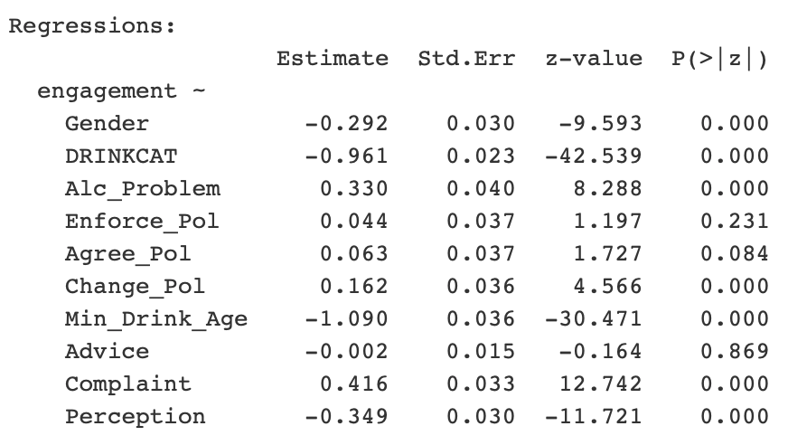

```{r setup, include=FALSE}
knitr::opts_chunk$set(echo = FALSE, fig.height = 5)
load("/Users/true/Documents/Files/Duke/STA723/Projects/3/Case-Study-3-team-5/dat.RData")

```


## Introduction

- Data: Surveys of undergraduate drinking habits in 4 years.
- Goal: 
    - Estimate response quality and survey engagement.
    - Find relationships between drinking behaviors and survey engagement.
- Model: 
    - Structual Equation Model (SEM)
  

## Likert Scale

- A typical psychometric response scale:
    - Five points: (1) Strongly disagree; (2) Disagree; (3) Neither agree nor disagree; (4) Agree; (5) Strongly agree
    
- The survey contains many nested Likert scale questions:
    - When a student is not engaged in the survey, it's likely that he/she tends to give the same answer for these questions.
    - Aim to estimate this effect 


    
    
    
## EDA - Example

- Question B15 in 1999 survey
```{r, echo=FALSE,  out.width = '100%', fig.align='center'}

```


## EDA - Example

- Histogram of sum over B15 questions
```{r, echo=FALSE,  out.width = '80%', fig.align='center'}

```

## Data preprocessing

- Missing data
    - Among variables of interest, around 2000 cases have missing data.
- Different ways to manipulate missing data
    - (1). Use complete case for analysis
    - (2). Impute with reasonable values
    - (3). Nonparametric Bayesian Imputation (DPMPM):
$$\begin{aligned}X_{ij}|z_i,\phi &\sim \text{Multinomial}(\phi_{z_i,j1}, ...,\phi_{z_ijd_j})\\
    z_i\pi &\sim \text{Multinomial}(\pi_1,...,\pi_\infty)\\
    pi_h &= V_h\prod_{g<h}(1-V_g), \ \ h=1,...,\infty\\
    V_h &\sim \text{Beta} (1,\alpha)\\
    \alpha &\sim Gamma(a_\alpha, b_\alpha)\\
    \phi_{hj} &= (\phi_{hj1},...,\phi_{hjd_j})\sim \text{Multinomial}(a_{j1},...,a_{jd_j})\end{aligned}$$
   
    
## Variables of Interest
```{r, echo=FALSE,  out.width = '100%', fig.align='center'}

```
    
    
## Main Model

```{r, echo=FALSE,  out.width = '100%', fig.align='center'}

```

- Ordered logit for indicators $I$
- Random scale model for Utility$V = e^{\tau \alpha_n}\beta^Tx_n$
- Likelihood $L = \sum_{n=1}^N ln \int_\beta\int_\alpha p(y_n|\cdot) p(I_n|\cdot)p(\alpha)p(\beta|\Omega) d\alpha d\beta$


## Simplified version

```{r, echo=FALSE,  out.width = '100%', fig.align='center'}
knitr::include_graphics("Graph2.png")
```

- Fit two models sperately:
    - First build up a SEM for the choice model.
    - Plug the residuals into the second SEM to find latent engagement factors.
    
    
    
    
## Model 1 - SEM plot

```{r, echo=FALSE,  out.width = '100%', fig.align='center'}
knitr::include_graphics("semplot1.png")
```

## Model 1 - Latent Variables

```{r, echo=FALSE,  out.width = '100%', fig.align='center'}
knitr::include_graphics("1L.png")
```

## Model 1 - Regression results

```{r, echo=FALSE,  out.width = '100%', fig.align='center'}
knitr::include_graphics("1R.png")
```


## Model 2 - SEM plot

```{r, echo=FALSE,  out.width = '100%', fig.align='center'}

```

## Model 2 - Latent Variables

```{r, echo=FALSE,  out.width = '100%', fig.align='center'}
knitr::include_graphics("2L.png")
```

## Model 2 - Regression results

```{r, echo=FALSE,  out.width = '100%', fig.align='center'}

```


## Conclusions:

- Students with drinking behaviors tend to be more engaged in the survey 

- Male are engaged in this alcohol study

- etc..

## Discussion

- Implement Bayesian version to account for uncertainty

- Autoencoder: find nonlinear relationship 
    - May lose interpretability

- Low-rank tensor factorization (e.g. sparse PARAFAC)
