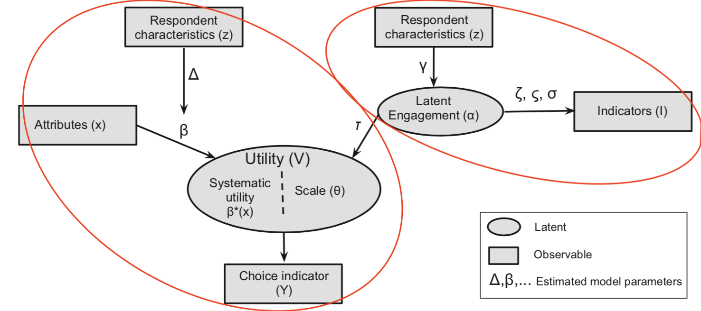
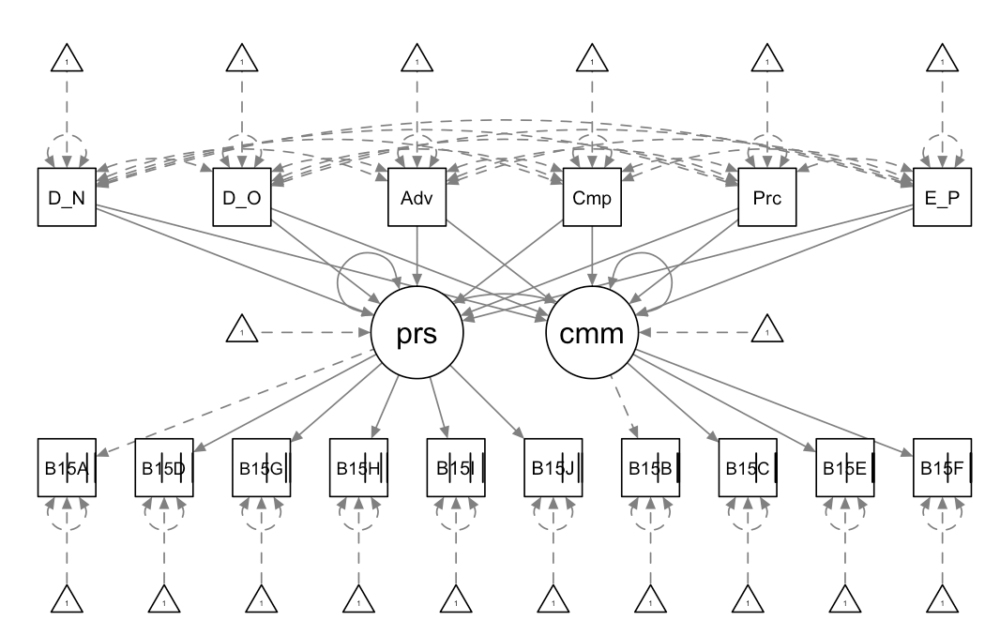
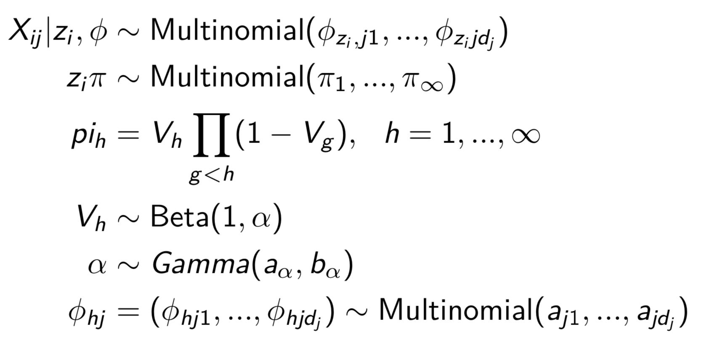
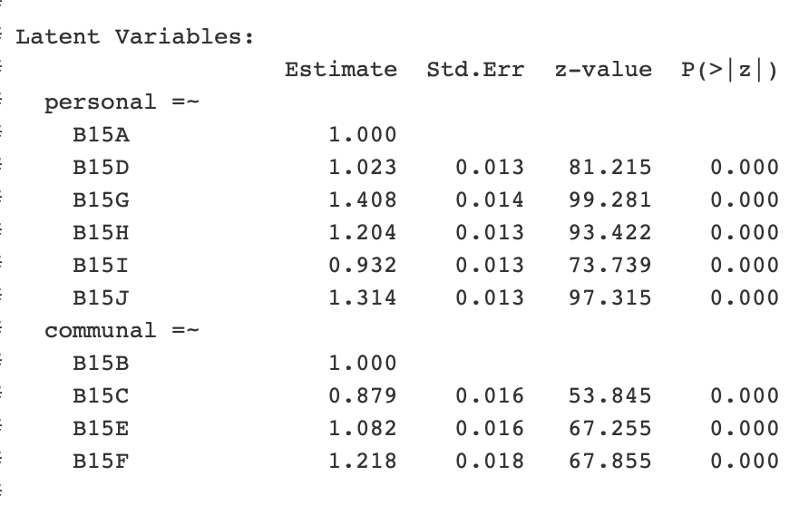
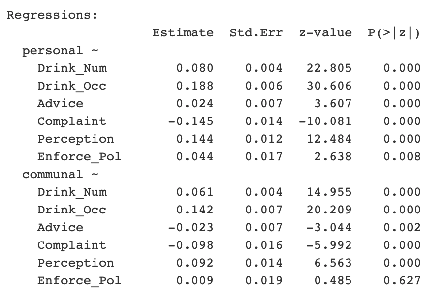
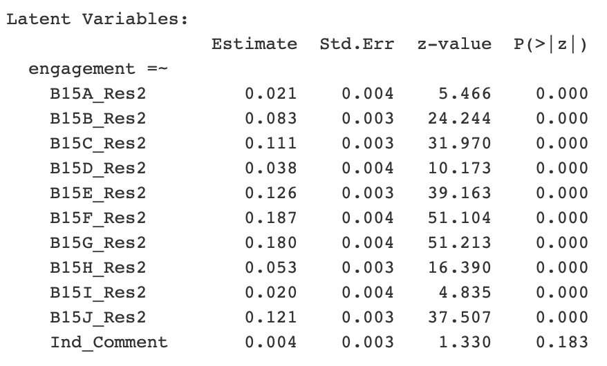

\fontsize{10}{11}
\selectfont

##### Abstract

Harvard SPH College Alcohol Study (CAS) collected a multi-round survey that interviewed students about their alcohol use and other high risk behaviors. The survey contains multiple Likert scale questions, and we identified that a large number of students tend to give the same answer for these similar questions, indicating that they're less engaged in the survey. To address this latent survey engagement factor, we use structual equation model (SEM) to estimate response quality and survey engagement, finding out relationships between drinking behaviors and survey engagement.


#### 1. Introduction

Harvard CAS contains four sets of survey responses from undergraduates in four years: 1993, 1997, 1999 and 2001. The survey mainly focus on students high risk behaviors (e.g. alcohol, tobacco and illicit drugs), including other information such as students' views on campus alcohol policies,  personal background variables, etc.

These four surveys each consists of over 400 questions, which could take up to an hour for a student to complete. The survey also has many similar nested questions (e.g. Fig \ref{fig:B15}). It's probable that some students are less engaged in completing the survey, finally returning the survey with non-informative responses. In psychology, these nested similar questions are called Likert scale questions. Here's a standard five point Likert scale: (1) Strongly Disagree (2) Disagree (3) Undecided (4) Agree (5) Strongly Agree. With so many Likert scale questions in a single survey, we find out that a non-negligible proportion of students tend to give the same answer for these questions. 

From this perspective, we are interested in exploring the latent survey engagement factor behind students. Specifically, we are interested in (1) quantifying and estimating latent survey engagement (2) exploring relationships between drinking behaviors and survey engagement. To make our analysis more detailed, our report focuses on section B15, which explores student attitudes towards a variety of alcohol-related policies on campus, in the 1999 survey. However, it is straightforward to use our approaches to analyze other questions and surveys.

#### 2. Materials and Methods

The philosophy behind our method is derived from "Linking response quality to survey engagement: A combined random scale and latent variable approach" [@hess2013linking]. This paper suggests modeling survey engagement as a latent multiplicative effect nestled in a larger structural equation model (SEM) [@ullman2003structural], essentially posotulating that engagement can be thought of as individualized heteroskedasticity. If an individual is not actively interested in the survey, then the data is likely to only contain a muted signal of their true preferences and vice-versa. Consequently, the model can be thought of in two parts. One SEM describing the structure of the mean response to the survey questions and another capturing the latent engagement variable that scales this mean response for an individual. However, implementing the exact model described in the Hess and Stathopoulus paper involves interacting latent variables, which can often be messy and non-intuitive in a frequentist context. Consequently, we divide the model into its two natural subparts (Fig. \ref{fig:simpleModel}). Since section B15 seems to naturally divide into questions about policies cracking down on personal alcohol use and questions about general changes to alcohol-related campus culture, we use two latent variables to capture this structure. These latent variables are then regressed on a series of personal characterstics (Fig \ref{fig:Model1_sem}). After modeling the mean survey using this SEM, we take the absolute value of the residuals (squaring them exacerbated the right skew of the residuals) from the predictions of individualized survey responses as an indication of the engagement related heteroskedacity not captured by the mean response model. We then load these residuals on an engagement variable that is in turn regressed on a series of personal characteristics (Fig \ref{fig:Model2_sem}) in a seperate SEM. We believe that this process accurately captures the latent engagement multiplicative effect in a two step modeling process.

#### 3. Results

##### 3.1 Exploratory Data Analysis & Data Preprocessing

Initial data exploration suggests that some students give the same answer for nested Likert scale questions (Fig \ref{fig:EDA1}). We can see a large number of students response with the first Likert scale (so their sum over 10 questions are 0), implying that engagement among students varies. 

The survey contains a large number of missing data, and we consider different ways to deal with it: (1) use complete cases, (2) manually impute with reasonable values for questions need not to answer, (3) use MICE [@buuren2010mice] to impute, (4) use DPMPM (Fig \ref{fig:DPMPM}, @dunson2009nonparametric, @si2013nonparametric). We will later explain our sensitivity analysis through different missing data manipulations. 

Instead of analyzing all questions in the survey, which is unnecessary and redundant, we select some important questions of interest (Fig \ref{fig:VI}). Specifically speaking, for personal characteristics, we include sex, age group, comments, drink_category (from codebook), drink_occ (question C8, C9), drink_num (question C8, C10), advice (question D4), complaint (question D5), perception (D3A, D3B), etc. To further address our concern on students' view on alchohol policies, we include questions related to their attitudes (question B1, B2, B3, B4, B5). For choice indicator $Y$, we will focus on question B15 (Fig \ref{fig:B15}). We preprocess these variables using different criteria and formulas, which is explicitly explained in our codebook for variables of interest (Fig \ref{fig:VI}). Among quesitons of interest, around 20% cases have missing data.


##### 3.2 Main Results

We have built two SEM to study the engagement of survey respondents. The results of the first model are presented in Fig \ref{fig:Model1_latent} and Fig \ref{fig:Model1_reg}. As shown in Fig \ref{fig:Model1_latent}, all p-values are small, suggesting the latent indicators are all significant. In terms of magnitude, question B15(f) has the highest factor loading on latent variable `communal` and B15(c) has the lowest loading. This shows that for respondents who care about general changes of campus alcohol use have stronger opinion in "making alcohol rules more clear" than serving non-alcohol drinks at campus events. Similarly, the factor loading on latent variable `personal` is the highest for B15(g) and is the lowest for B15(i). The respondents who care more about personal alcohol use tend to pay more attention to the enforcement of alcohol rules, rather than the responsibility of hosts regarding problematic alcohol use. The regression coefficients with standard errors are summarized in Fig \ref{fig:Model1_reg}. The enforcement of current alcohol policies has significant impact on personal awareness but not communal awareness of alcohol use. Drinking habits (including occations and numbers of alcohols taken within 30 days) and perception of proportion of binge drinkers among friends have positive influence on both personal and communal awareness. Those who have complained about drinking behaviours of fellow students also have higher personal and communal awareness. One interesting finding is that those who have asked someone to stop drinking before have higher communal awareness of campus alcohol use, but lower personal awareness. It also interesting to note that the magnitudes of all the coefficients in the communal latent factor regression are less than their counterparts relating to the personal latent factor. This somewhat intuitively suggests that personal characteristics are not as indicative of preferences affecting communal campus culture and activities. 

In the second model, we analyzed individual engagement in this survey. The results are presented in Fig \ref{fig:Model2_latent} and Fig \ref{fig:Model2_reg}. According to Fig \ref{fig:Model2_latent}, the engagement in the survey does not seem to have significant impact on leaving comments for the survey. But other than that, the variation in their responses (measured by the absolute values of residuals from the first model) are affected by their engagement in the survey. If the respondents are more engaged, their answers to these questions tend to relflect a stronger signal of their preferences. As shown in Fig \ref{fig:Model2_reg}, the following characteristics are found to have significant impact on engagement: Males seem to be less engaged than females in this survey. Respondents who drink more or have more friends who are binge drinkers are less engaged. Respondents who think legal drinking age should be below 21 are also less engaged. Those who have complained about improper behaviours before, or have desire to change current campus alcohol policies are more engaged than others.

The above results suggest that personal drinking habits, attitudes towards alcohol policies as well as the drinking behaviours of friends all have an impact on the engagement of the respondents.

##### 3.3 Sensitivity Analysis

About 20% cases have missing data with respect to our variables of interest (Fig \ref{fig:VI}). We consider four ways to manipulate these missing data: (1) use complete cases, (2) manually impute with reasonable values for questions no need to answer, (3) use MICE [@buuren2010mice] to impute, (4) use nonparamatric Bayesian imputation DPMPM (Fig \ref{fig:DPMPM}, @dunson2009nonparametric, @si2013nonparametric). We would expect DPMPM to have the best performance since it's designed for large-scale categorical surveys.

Our models using four different ways above didn't show distinguishable difference. This is probably because proportion of missing data is relatively low among questions we focus on. Therefore we choose to use the original dataset in future work, and explore missing data manipulation further.


#### 4. Discussion

Our Structural Equation Model successfully explores latent survey engagement factors in Havard CAS dataset. We also discover relationships between drinking behaviors and survey engagement. However, we carry out a simplified version of original model due to constraint of lavaan package [@rosseel2012lavaan]. A direct future work is to implement the model jointly. To further account for uncertainty, we may implement it using Rstan or JAGS.

To find nonlinear effects of latent factors, we may consider using autoencoder [@kramer1991nonlinear]. Autoencoder can be viewed as a nonlinear factor analysis that primarily uses neural networks to first encode the input and later decode it. However, autoencoder may suffer from interpretability due to its complexity.

Another direction is to consider low-rank factorization of contingency tables. Sparse PARAFAC [@@zhou2015bayesian] uses low rank tensor factorization together with parallel factor analysis, which is helpful when the sample size is massively less than the number of cells. This model can be further used for latent class clustering.


\newpage 

### Appendix


```{r, echo=FALSE, fig.cap="\\label{fig:B15} Question B15", out.width = '100%', fig.align='center'}
knitr::include_graphics("B15.png")
```


```{r, echo=FALSE, fig.cap="\\label{fig:Model} Model Structure", out.width = '100%', fig.align='center'}
knitr::include_graphics("Graph.png")
```

```{r, echo=FALSE, fig.cap="\\label{fig:simpleModel} Simplified Model", out.width = '100%', fig.align='center'}

```

```{r, echo=FALSE, fig.cap="\\label{fig:Model1_sem} Model 1 SEM plot", out.width = '80%', fig.align='center'}

```

```{r, echo=FALSE, fig.cap="\\label{fig:Model2_sem} Model 2 SEM plot", out.width = '80%', fig.align='center'}
knitr::include_graphics("semplot2.png")
```


```{r, echo=FALSE, fig.cap="\\label{fig:EDA1} Histogram of sum of individual answers for question B15 ", out.width = '70%', fig.align='center'}
knitr::include_graphics("EDA1.png")
```

```{r, echo=FALSE, fig.cap="\\label{fig:DPMPM} Infinite Mixture of Product of Multinomials", out.width = '60%', fig.align='center'}

```

```{r, echo=FALSE, fig.cap="\\label{fig:VI} Variables of Interest", out.width = '100%', fig.align='center'}
knitr::include_graphics("VI.png")
```


```{r, echo=FALSE, fig.cap="\\label{fig:Model1_latent} Model 1 Latent Factors", out.width = '80%', fig.align='center'}

```

```{r, echo=FALSE, fig.cap="\\label{fig:Model1_reg} Model 1 Regression results", out.width = '80%', fig.align='center'}

```

```{r, echo=FALSE, fig.cap="\\label{fig:Model2_latent} Model 2 Latent Factors", out.width = '80%', fig.align='center'}

```

```{r, echo=FALSE, fig.cap="\\label{fig:Model2_reg} Model 2 Regression results", out.width = '80%', fig.align='center'}
knitr::include_graphics("2R.png")
```


#### References